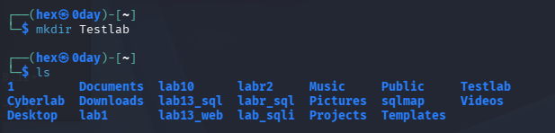
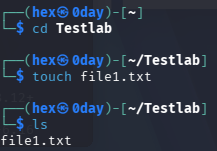
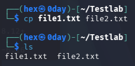

# Lab 02 - Files and Directories

## Objective

The objective of this lab was to learn how to create, copy, move, rename, and delete files and directories in Linux. These are fundamental skills required for Linux administration, cybersecurity operations, and day-to-day command-line usage.

---

## Lab Environment

* VMware Workstation Pro
* Kali Linux
* Username: hex
* Hostname: 0day

---

## Commands Practiced

### mkdir

Creates a new directory.

### touch

Creates a new file.

### cp

Copies files.

### mv

Moves or renames files and directories.

### rm

Deletes files.

### rmdir

Deletes empty directories.

### >

Redirects output to a file and overwrites existing content.

### >>

Appends output to the end of a file without overwriting existing content.

---

## Procedures Performed

1. Created directories using `mkdir`.
2. Created files using `touch`.
3. Verified files and directories using `ls`.
4. Copied files using `cp`.
5. Renamed files using `mv`.
6. Moved files using `mv`.
7. Created file content using output redirection.
8. Appended content using `>>`.
9. Deleted files using `rm`.
10. Deleted empty directories using `rmdir`.

---

## Screenshots

### Screenshot 1 - Creating Directories

### Screenshot 2 - Creating Files

### Screenshot 3 - Copying Files

### Screenshot 4 - Moving and Renaming Files

(Embed screenshot4-move-rename-file.png)

### Screenshot 5 - Output Redirection

(Embed screenshot5-redirection.png)

### Screenshot 6 - Deleting Files and Directories

(Embed screenshot6-delete-files-directories.png)

---

## Key Findings

* Directories are created using `mkdir`.
* Files can be created using `touch`.
* The `cp` command creates a duplicate copy of a file.
* The `mv` command can both move and rename files.
* The `rm` command permanently removes files.
* The `rmdir` command removes empty directories.
* `>` overwrites file contents.
* `>>` appends new content to existing files.

---

## Lessons Learned

This lab provided practical experience managing files and directories through the Linux command line. Understanding these operations is essential for system administration, security investigations, scripting, log management, and penetration testing activities.

---

## Status

Completed

