# Lab 03 – File Analysis & Linux Filesystem Architecture

## Objective

This lab focused on understanding how Linux stores, identifies, and manages files while exploring the Linux filesystem hierarchy. The lab also introduced file analysis techniques commonly used by Linux administrators, SOC analysts, incident responders, and penetration testers.

---

## Topics Covered

* File creation and manipulation
* File content inspection
* File type identification
* File metadata analysis
* Large file viewing
* Linux filesystem hierarchy
* Security relevance of system files and logs

---

## Commands Practiced

```bash
cat
head
tail
wc
file
stat
less
```

---

## Practical Activities

### 1. Created Investigation Workspace

Created a dedicated lab directory and investigation log file.

### 2. File Content Analysis

Used:

```bash
cat
head
tail
wc
```

to inspect and analyze file contents.

### 3. File Type Identification

Used:

```bash
file
```

to determine actual file types regardless of file extensions.

### 4. Metadata Investigation

Used:

```bash
stat
```

to view file ownership, timestamps, permissions, and other metadata.

### 5. Large File Navigation

Used:

```bash
less
```

to navigate large files and perform searches.

### 6. Linux Filesystem Exploration

Explored:

```text
/
/home
/etc
/var/log
/usr
/boot
/dev
/proc
```

and learned their roles within the Linux operating system.

---

## Screenshots

### Lab Workspace Creation

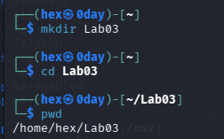

### File Analysis Commands

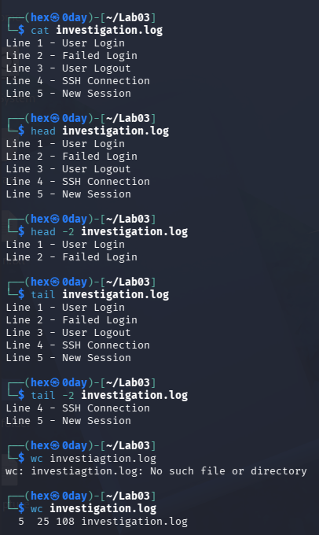

### File Identification

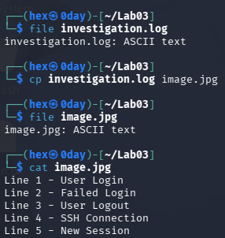

### File Metadata

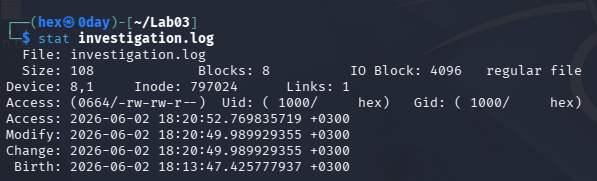

### less Command

*command 
#### 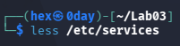 

*Terminal Pager Interface
#### 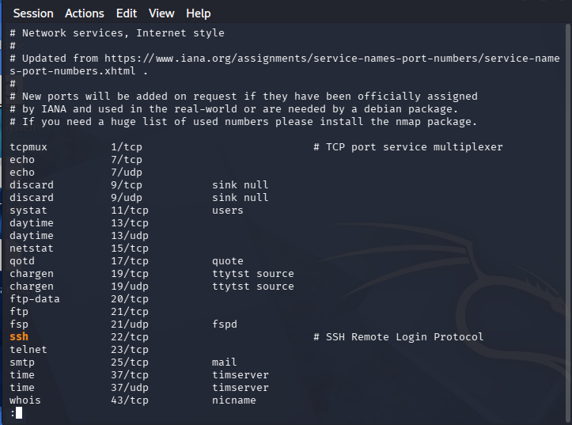 

### /home Directory

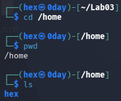

### /etc Directory

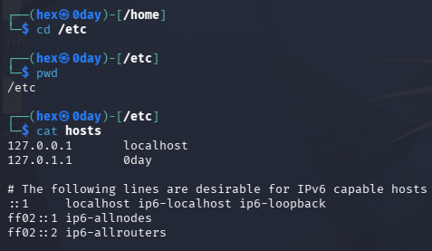

### /var/log Directory

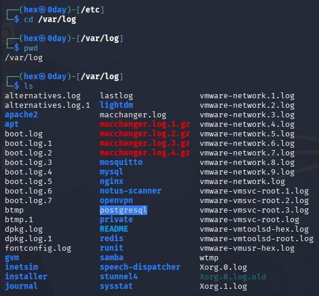

### /usr Directory

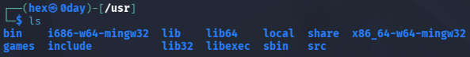

### /boot Directory

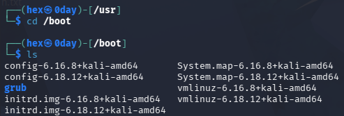

### /dev Directory

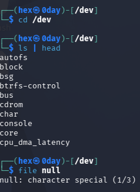

### /proc Directory

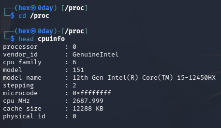

---

## Key Learning Outcomes

* Learned how to inspect file contents using Linux command-line tools.
* Understood the difference between file content and file extension.
* Learned the importance of metadata in security investigations.
* Explored major Linux filesystem directories and their purposes.
* Understood the Linux principle that many system resources are represented as files.
* Gained practical experience relevant to Linux administration, SOC operations, incident response, and penetration testing.

