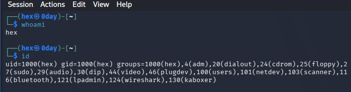
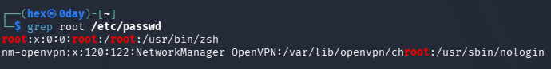
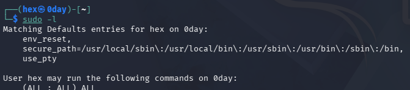
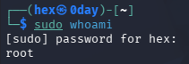
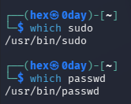
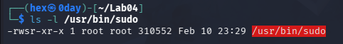
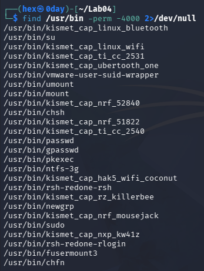
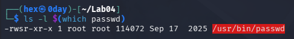
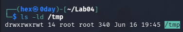
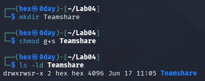

# Lab 05 - Linux Privileges, sudo, SUID, SGID & Sticky Bit

## Overview

This lab focuses on Linux privilege management and special permission mechanisms used throughout Linux systems.

The exercises demonstrate how Linux controls administrative access, how users temporarily obtain elevated privileges, and how special permission bits such as SUID, SGID, and Sticky Bit influence system behavior.

These concepts are fundamental for:

- Linux Administration
- System Hardening
- Security Operations Center (SOC)
- Incident Response
- Privilege Escalation Analysis
- Penetration Testing

---

## Objectives

By completing this lab, I learned:

- The role of the root account
- How sudo provides temporary privilege elevation
- The Principle of Least Privilege
- How Linux identifies users through UIDs
- How to locate system binaries
- How SUID works
- How SGID works
- How Sticky Bit works
- Why these mechanisms are important from a cybersecurity perspective

---

## Tools and Commands Used

```bash
whoami
id
grep
sudo
which
find
ls
chmod
mkdir
```

---

## Key Concepts Covered

### Root Account

Linux contains a special administrative account called root.

The root account has unrestricted access to the operating system and is identified by UID 0.

---

### sudo

The sudo command allows authorized users to execute commands with elevated privileges without logging in directly as root.

This supports secure administration while following the Principle of Least Privilege.

---

### SUID (Set User ID)

SUID allows a program to run with the permissions of the file owner rather than the user executing it.

Common examples include:

- sudo
- passwd

---

### SGID (Set Group ID)

SGID allows files created inside a directory to inherit the directory's group ownership.

This is commonly used for shared team environments.

---

### Sticky Bit

Sticky Bit prevents users from deleting files owned by other users inside shared writable directories.

A common example is:

```text
/tmp
```

---

## Screenshots

### User Identification



---

### Root Account Investigation



---

### sudo Rights



---

### sudo Privilege Escalation



---

### Locating System Binaries



---

### SUID on sudo



---

### Discovering SUID Files



---

### passwd SUID Analysis



---

### Sticky Bit Investigation



---

### SGID Practical Demonstration



---

## Cybersecurity Relevance

Understanding Linux privilege management is critical for security professionals.

Attackers frequently attempt to exploit misconfigured permissions and SUID binaries to gain elevated privileges.

Defenders must understand:

- Access control
- User permissions
- Ownership
- Privilege escalation paths

to effectively secure Linux systems and investigate suspicious activity.

---

## Lab Outcome

This lab provided practical experience with Linux privilege management and introduced the permission mechanisms that form the foundation of Linux security architecture.

The concepts learned in this lab will be directly applicable in future topics including:

- Linux Hardening
- Incident Response
- Security Monitoring
- Privilege Escalation Analysis
- Penetration Testing
