# Lab 06 - Linux Processes, Services & System Monitoring

## Overview

This lab focuses on Linux processes, services, job control, and system monitoring.

The exercises demonstrate how Linux manages running programs, tracks system resources, controls background and foreground jobs, and manages services through systemd.

These concepts are fundamental for:

- Linux Administration
- Security Operations Center (SOC)
- Incident Response
- Threat Hunting
- Malware Analysis
- System Monitoring
- Penetration Testing

---

## Objectives

By completing this lab, I learned:

- What a process is
- The difference between PID and PPID
- Parent and child process relationships
- How to view running processes
- How to monitor CPU and memory usage
- How to use top and htop
- How to search for specific processes
- How background and foreground jobs work
- How to terminate processes
- How Linux services operate
- How systemd manages services
- How to monitor system resources

---

## Tools and Commands Used

```bash
ps
pstree
top
htop
grep
jobs
kill
systemctl
free
lscpu
uptime
lsof
```

---

## Key Concepts Covered

### Process

A process is a running instance of a program.

Examples:

- Firefox
- Terminal
- SSH
- NetworkManager

---

### PID (Process ID)

Every running process receives a unique Process ID (PID).

Linux uses PIDs to track and manage processes.

---

### PPID (Parent Process ID)

Every process is started by another process.

Linux tracks this relationship using the Parent Process ID (PPID).

Example:

```text
bash
 └── sleep
```

In this example:

- bash = Parent Process
- sleep = Child Process

---

### Foreground Process

A process that occupies the terminal and requires user interaction.

Example:

```bash
top
```

---

### Background Process

A process that runs without occupying the terminal.

Example:

```bash
sleep 300 &
```

---

### Service

A long-running background process managed by Linux.

Examples:

- ssh
- NetworkManager
- cron

---

### systemd

The service manager used by modern Linux distributions.

systemd is responsible for starting, stopping, and monitoring services.

---

## Screenshots

### Screenshot 1 — Basic Process View

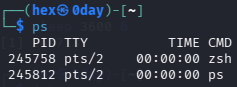

#### Command Used

```bash
ps
```

#### Purpose

Display currently running processes associated with the current terminal session.

#### Explanation

The `ps` command provides a snapshot of active processes and displays information such as PID, terminal association, execution time, and command name.

---

### Screenshot 2 — Detailed Process Information

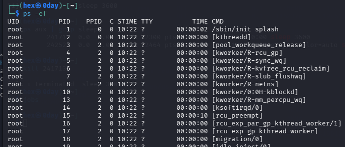

#### Command Used

```bash
ps -ef
```

#### Purpose

Display detailed information about all running processes.

#### Explanation

The `-e` option displays every process on the system.

The `-f` option displays full details including UID, PID, PPID, start time, and command information.

---

### Screenshot 3 — Full Process Monitoring

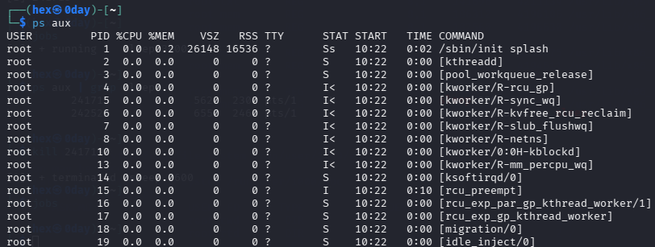

#### Command Used

```bash
ps aux
```

#### Purpose

View detailed process information including CPU and memory usage.

#### Explanation

This command is widely used by Linux administrators and SOC analysts to investigate running processes and identify resource consumption.

---

### Screenshot 4 — Process Tree

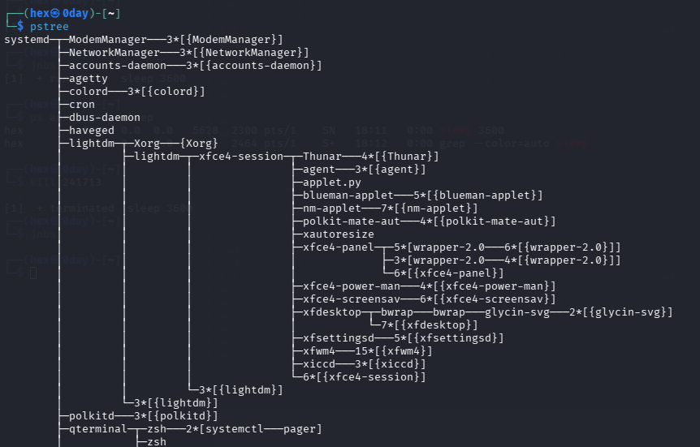

#### Command Used

```bash
pstree
```

#### Purpose

Visualize parent-child process relationships.

#### Explanation

The output displays how processes are organized hierarchically, making it easier to understand process ancestry and dependencies.

---

### Screenshot 5 — Real-Time Monitoring with top

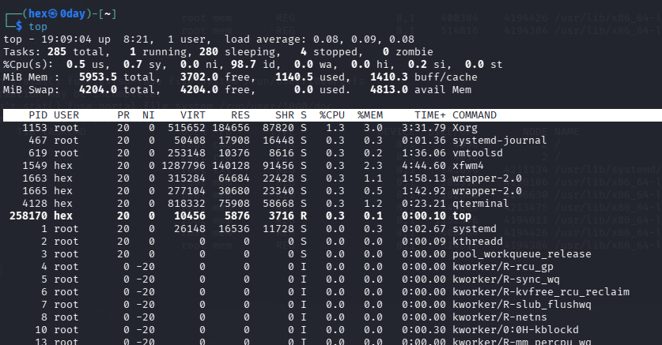

#### Command Used

```bash
top
```

#### Purpose

Monitor system activity in real time.

#### Explanation

The command continuously updates CPU usage, memory consumption, running processes, load averages, and system performance statistics.

---

### Screenshot 6 — Real-Time Monitoring with htop

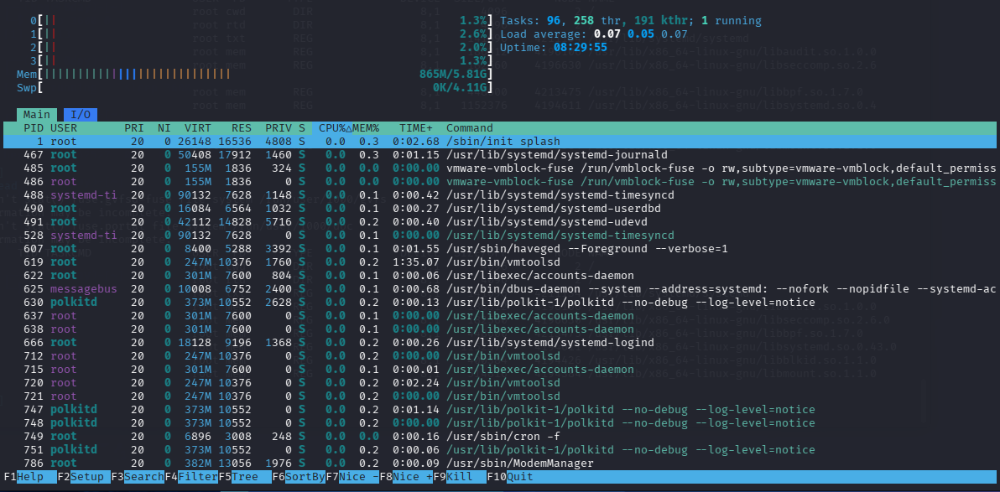

#### Command Used

```bash
htop
```

#### Purpose

Interactively monitor processes and system resources.

#### Explanation

htop provides a more user-friendly interface than top and includes colorized output, scrolling, filtering, and process management capabilities.

---

### Screenshot 7 — Process Search

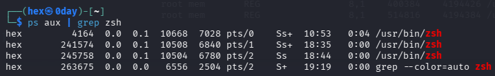

#### Command Used

```bash
ps aux | grep zsh
```

#### Purpose

Locate a specific running process.

#### Explanation

Modern Kali Linux uses Z Shell (zsh) as the default shell.

The pipe operator (`|`) sends the output of `ps aux` into `grep`, displaying only lines containing `zsh`.

---

### Screenshot 8 — Background Job

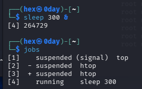

#### Command Used

```bash
sleep 300 &
jobs
```

#### Purpose

Demonstrate background process execution.

#### Explanation

The ampersand (`&`) instructs Linux to run the process in the background.

The `jobs` command verifies that the process is currently running.

---

### Screenshot 9 — Process Termination

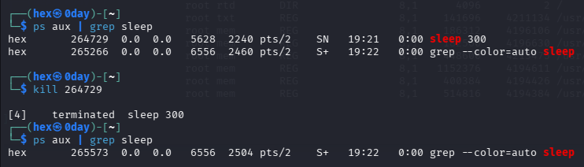

#### Command Used

```bash
ps aux | grep sleep
kill PID
ps aux | grep sleep
```

#### Purpose

Demonstrate how to identify and terminate a running process.

#### Explanation

The process was first located using `ps aux`.

The PID was then used with the `kill` command to terminate the process.

A final verification confirmed that the process was no longer running.

---

### Screenshot 10 — Service Investigation

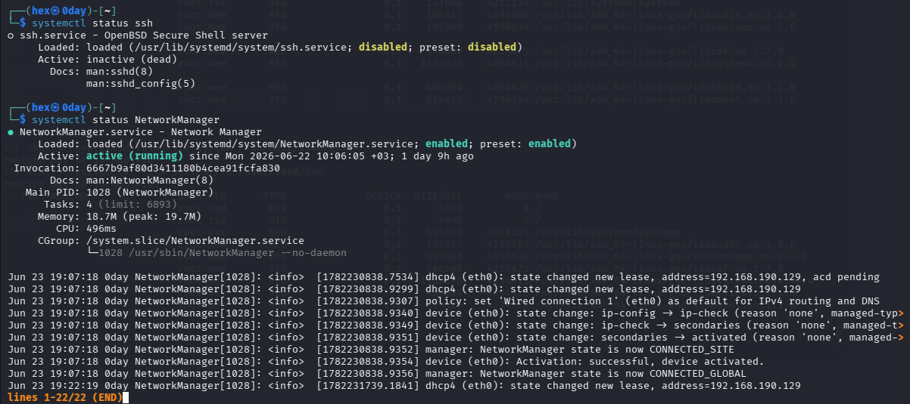

#### Command Used

```bash
systemctl status ssh
systemctl status NetworkManager
```

#### Purpose

Investigate Linux service status.

#### Explanation

The SSH service was disabled while NetworkManager was active and running.

This demonstrates how Linux services can operate in different states depending on system configuration.

---

### Screenshot 11 — Active Services

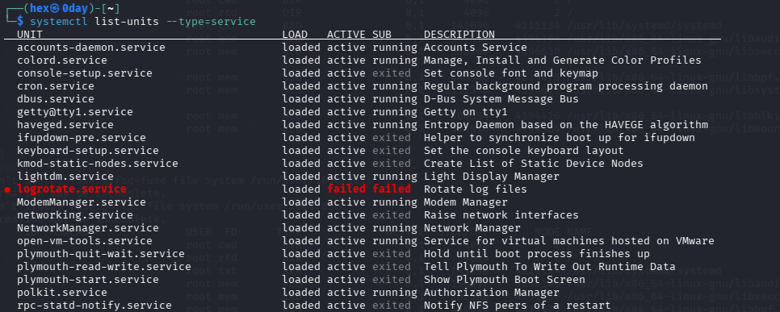

#### Command Used

```bash
systemctl list-units --type=service
```

#### Purpose

Display active services managed by systemd.

#### Explanation

The output provides a list of loaded services and their operational status.

---

### Screenshot 12 — Memory Information

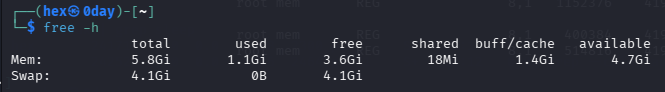

#### Command Used

```bash
free -h
```

#### Purpose

Display memory utilization statistics.

#### Explanation

The `-h` option displays memory values in a human-readable format such as MB and GB.

---

### Screenshot 13 — CPU Information

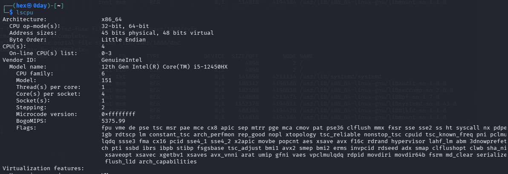

#### Command Used

```bash
lscpu
```

#### Purpose

Display processor architecture and hardware details.

#### Explanation

The output includes CPU model, architecture, thread count, virtualization information, and processor capabilities.

---

### Screenshot 14 — System Uptime

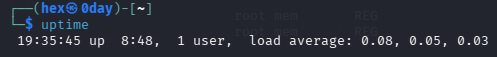

#### Command Used

```bash
uptime
```

#### Purpose

Display system runtime information.

#### Explanation

The command displays system uptime, logged-in users, and load averages.

---

### Screenshot 15 — Open Files Investigation

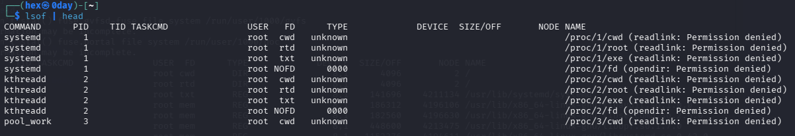

#### Command Used

```bash
lsof | head
```

#### Purpose

View files currently opened by running processes.

#### Explanation

`lsof` stands for List Open Files.

The `head` command limits the output to the first few lines, making the information easier to review.

---

## Cybersecurity Relevance

Understanding Linux processes and services is critical for cybersecurity professionals.

Attackers frequently create malicious processes, establish persistence through services, and consume system resources during attacks.

Security teams must understand:

- Process identification
- Parent-child relationships
- Service management
- Resource monitoring
- Process termination
- System performance analysis

to effectively detect and respond to suspicious activity.

---

## Lab Outcome

This lab provided practical experience with Linux process management, service administration, and system monitoring.

The concepts learned in this lab form the foundation for future topics including:

- Linux Networking
- Log Analysis
- Threat Hunting
- Incident Response
- Malware Analysis
- Security Monitoring
- Penetration Testing
